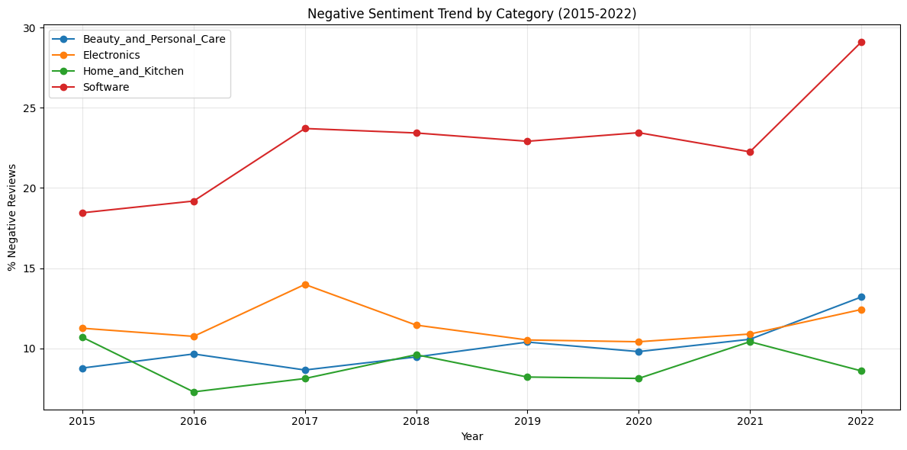
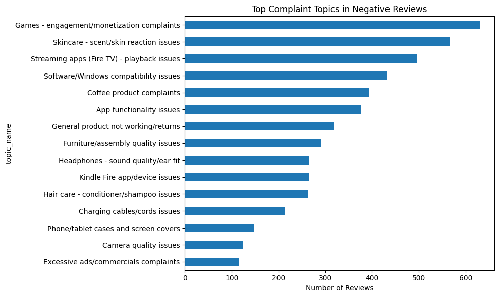
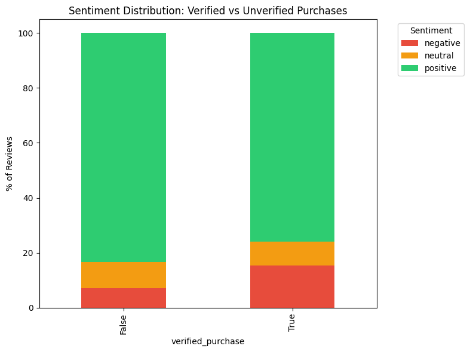
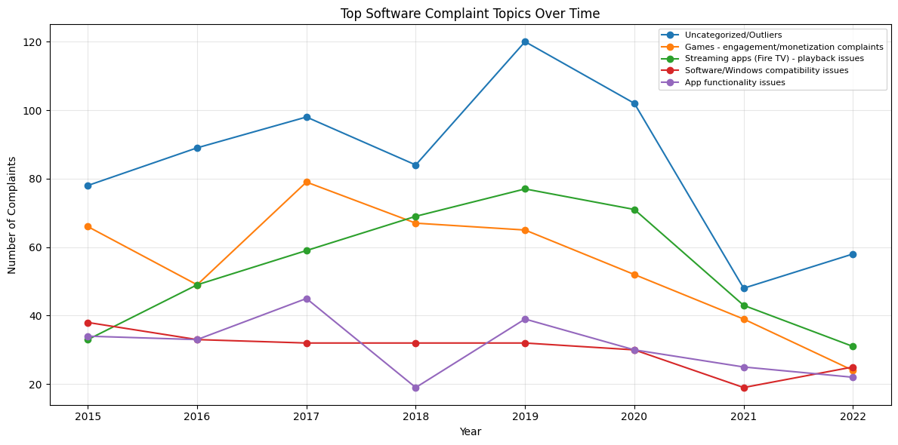

# 📊 Amazon Review Sentiment Analytics

An end-to-end sentiment analytics pipeline built on 74,545 real Amazon product reviews — from raw data through a fine-tuned transformer model to a live, interactive dashboard backed by a production-style PostgreSQL database.

**🔗 [Live Dashboard](https://amazon-review-sentiment-analytics.streamlit.app/)** &nbsp;|&nbsp; **🤗 [Fine-tuned Model on HuggingFace Hub](https://huggingface.co/AliAmmar512/amazon-review-sentiment-distilbert)** &nbsp;|&nbsp; **💻 [Source Code](https://github.com/AliAmmar512/amazon-review-sentiment-analytics)**

---

## The Problem

Businesses selling on platforms like Amazon accumulate thousands of reviews, but reading through them manually to understand *what's actually going wrong* — and *whether it's getting better or worse* — doesn't scale. This project builds a system that ingests raw review data, classifies sentiment with a fine-tuned transformer, extracts the specific topics driving negative reviews, and surfaces it all through a live dashboard that can be queried and explored directly.

## Architecture

```
Amazon Reviews 2023 Dataset (HuggingFace)
        │
        ▼
  Data Cleaning & Weak Labeling  (pandas)
        │
        ├──────────────────────────────┐
        ▼                              ▼
 Model Training                 PostgreSQL (Supabase)
 (TF-IDF baseline +             categories / products / reviews
  fine-tuned DistilBERT)                │
        │                               │
        ▼                               │
 HuggingFace Hub                        │
 (hosted model weights)                 │
        │                               │
        └───────────────┬───────────────┘
                         ▼
              Streamlit Dashboard
      (trends · topics · model comparison ·
       live SQL explorer · live prediction)
                         │
                         ▼
                  Docker container
                         │
                         ▼
              Streamlit Community Cloud
                    (public, live)
```

## Key Results

### Model Comparison

| Metric | TF-IDF + Logistic Regression | Fine-tuned DistilBERT |
|---|---|---|
| Macro F1 | 0.61 | **0.72** |
| Accuracy | 0.77 | **0.89** |
| Negative F1 | 0.61 | **0.76** |
| Neutral F1 | 0.34 | **0.46** |
| Positive F1 | 0.88 | **0.95** |

The fine-tuned transformer improved macro F1 by 11 points over the baseline, with the largest relative gains on the hardest classes (negative +15pts, neutral +12pts). The baseline's biggest error was misclassifying 1,396 neutral reviews as positive; the fine-tuned model cut that specific error down to 315 — the main driver of its higher neutral-class score.

Class imbalance (78% positive / 13% negative / 9% neutral, typical of e-commerce review data) was handled with stratified sampling and class-weighted loss rather than accuracy alone — accuracy is misleading here, since a model that always predicts "positive" would score ~78% while learning nothing.

### Key Insights

1. **Software has 2-3x the negative sentiment rate of physical product categories** (18-29% vs 8-14% across 2015-2022), driven mainly by streaming/Fire TV playback issues, app functionality problems, and Windows compatibility complaints — identified via BERTopic topic modeling on negative reviews.
2. **Verified purchases show a higher negative review rate (15%) than unverified purchases (7%)** — a counter-intuitive finding worth investigating further; it runs against the common assumption that unverified reviews skew more positive/fake.
3. **Streaming app playback issues have been the most persistent Software complaint since 2017**, while the category's 2022 sentiment spike appears driven by emerging issues not captured in the current topic set — a known gap flagged honestly rather than papered over.




## Dashboard Features

- **Overview & Trends** — sentiment trend by year and category, top complaint topics from BERTopic, filterable by category
- **Model Comparison** — live-rendered confusion matrices and metrics for both models, side by side
- **SQL Explorer** — run preset or custom analytical queries live against the PostgreSQL database, with SELECT-only enforcement, query timeouts, and row caps
- **Live Prediction** — paste any review text and get an instant sentiment prediction from the fine-tuned model, with confidence scores



## Tech Stack

- **Data & ML:** Python, pandas, scikit-learn, HuggingFace Transformers (DistilBERT), BERTopic
- **Database:** PostgreSQL (Supabase), SQLAlchemy
- **Dashboard:** Streamlit, Plotly
- **Infra:** Docker, Streamlit Community Cloud, HuggingFace Hub (model hosting)
- **Training environment:** Google Colab (T4 GPU)

## Design Decisions & Tradeoffs

- **Weak-labeled sentiment from star ratings** (1-2★ negative, 3★ neutral, 4-5★ positive) rather than manual annotation — a standard, defensible approach for a dataset this size, but it means the "ground truth" itself has some noise (a 3-star review can be genuinely mixed, not cleanly neutral).
- **Amazon Reviews 2023 (McAuley Lab) dataset** used instead of live scraping — Amazon's Terms of Service prohibit scraping, and this dataset is a recognized, license-clean academic/industry source with richer metadata (verified purchase, helpful votes) than a scrape would easily provide.
- **Neutral sentiment remains the hardest class** (46% F1 even for the fine-tuned model) — this reflects genuine ambiguity in 3-star reviews, which often mix positive and negative language in the same review, rather than a modeling shortfall.
- **`sample_review_title` naming** — this dataset does not include actual product names, only ASINs and review-level metadata. The column shows an example review title per product for reference, not a real product name; this is documented rather than hidden.
- **SQL Explorer security** — the live query tool enforces SELECT-only queries, blocks stacked statements and DDL/write keywords, applies a 5-second statement timeout, and caps results at 1,000 rows. This reduces app-layer risk but is not a substitute for database-level role permissions in a real production deployment.

## Known Limitations

- Dataset trend analysis is limited to 2015-2022 for readability; earlier years (2000-2014) had too little volume for meaningful trend charts, and 2023 is a partial year (data collection stopped mid-March).
- The model is trained on English-language, U.S. Amazon review data — performance on other markets, languages, or platforms is untested.
- No automated retraining or drift monitoring is in place; in a production setting, incoming review distributions would need periodic revalidation against the training data.

## Running Locally

```bash
git clone https://github.com/AliAmmar512/amazon-review-sentiment-analytics.git
cd amazon-review-sentiment-analytics
python -m venv .venv
.venv\Scripts\Activate.ps1        # Windows
pip install -r requirements.txt
streamlit run app.py
```

### With Docker

```bash
docker build -t amazon-sentiment-dashboard .
docker run -p 8501:8501 amazon-sentiment-dashboard
```

Requires a `.streamlit/secrets.toml` (or `.env`) with `DATABASE_URL` set to a PostgreSQL connection string for the SQL Explorer tab to function; the rest of the dashboard works from the bundled parquet files without it.

## Author

Ali Ammar — CS student at FAST-NUCES Islamabad
[GitHub](https://github.com/AliAmmar512) &nbsp;|&nbsp; [HuggingFace](https://huggingface.co/AliAmmar512)